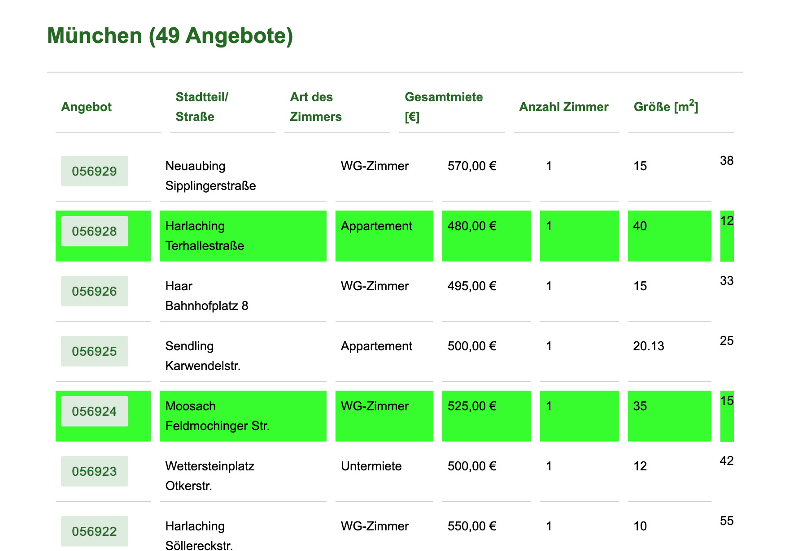

# Chrome Plugin für die Studentenwerk Privatzimmervermittlung

## Beschreibung
Das Programm markiert alle Zeilen grün, die unter der maximalen Miete, unter dem Preis pro Quadratmeter und über der minimalen Fläche liegen. Die passenden Ergebnisse werden dann mit grüner Farbe hinterlegt.

Demo Screenshot für München:

Please give me a star if you like this repo ;=)

Copyright 2021 **© Daniel Gockel**